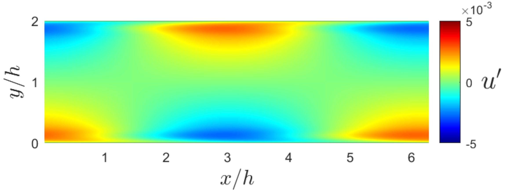
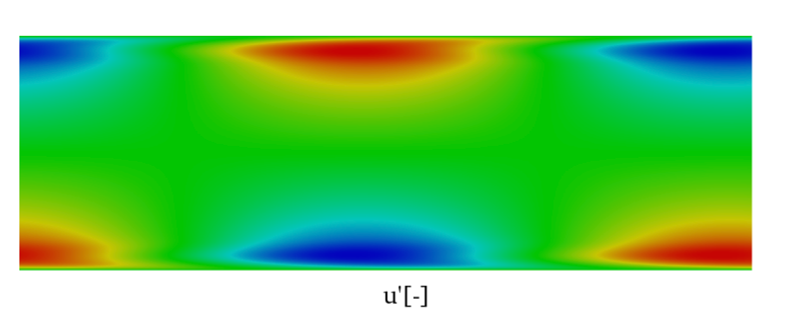
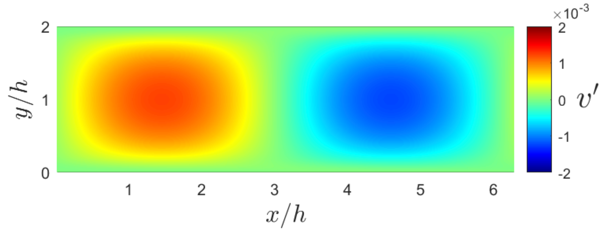
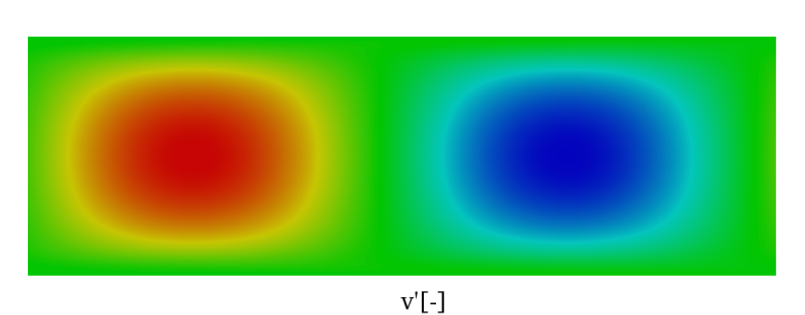

# Tutorial: Channel Flow Stability Analysis

Runtime: < 1 min

## Goal

This tutorial demonstrates how to set up and run a **viscous incompressible channel flow** simulation and perform a **global modal stability analysis** to identify the most unstable eigenmodes of the flow. It is the simplest tutorial in this solver and serves as a starting point for understanding the simulation pipeline without the complexity of shock fitting or high-temperature chemistry.


The workflow covers:
1. Linearizing the governing equations around the base flow. The base flow is initialized with a Poiseuille-like profile.
2. Computing eigenvalues and eigenmodes to determine flow stability.
3. Comparing the obtained results with the reference.

---

## Step-by-Step Walkthrough

To avoid redundancy, the MATLAB code is going to be used to illustrate the example. An analogous version in Julia of the tutorial with identical variable naming is also available.

### Step 1 -- Environment Setup (`main.m`)

```matlab
clear all
clc
solver_dir = '../../'; % Update this path to the absolute path of the solver root directory on your system
solution = struct();
solution.solver_dir = solver_dir;

addpath(solver_dir + "utils/Initialization/")
addpath(solver_dir + "utils/Mesh/")
addpath(solver_dir + "utils/Operators/")
addpath(solver_dir + "chemistry/")
addpath(solver_dir + "utils/Postprocessing/")
addpath(solver_dir + "utils/Time_marching/")
addpath(solver_dir + "utils/Shock_fitting/")
addpath(solver_dir + "utils/Stability_analysis/")
addpath(solver_dir + "utils/Stability_analysis/Eigenvalues/")
addpath(solver_dir + "utils/Stability_analysis/Modal_stability_analysis/")
```

The workspace is cleared and all required utility directories are added to the MATLAB path. The variable `solver_dir` points to the solver root relative to this tutorial folder. Update it if you place the tutorial elsewhere.

---

### Step 2 -- Load Input Parameters (`main.m`)

```matlab
filename = './input_file.m';
LOAD_INPUT_VARIABLES(filename);
```

All simulation parameters are defined in `input_file.m` and loaded into the `solution` struct. The most important settings are described below.

---

### Step 3 -- Initialize Chemistry Model (`main.m`)

```matlab
chemistry = SET_CHEMISTRY(solution);
```

Even though chemistry is **disabled** for this case (`solution.chemistry.is_chemistry_enabled = false`), the chemistry struct is still initialized to maintain a consistent interface with the rest of the solver.

---

### Step 4 -- Initialize Mesh and Solution (`main.m`)

```matlab
solution = INITIALIZATION(solution, solution_save, chemistry);
PLOT_INITIAL_SET_UP(solution);
```

`INITIALIZATION` generates the computational mesh and computes the initial flow field. For the channel geometry, the domain is a rectangle of size `Lx x Ly`. `PLOT_INITIAL_SET_UP` displays the mesh and initial conditions for visual verification.

---

### Step 5 -- Visualize the Base Flow (`main.m`)

```matlab
figure(1)
hold on
plot_x_coords = solution.mesh.x;
plot_y_coords = solution.mesh.y;
plot_c_data = solution.var.rho_u(2:end-1, 2:end-1) ./ solution.var.rho(2:end-1, 2:end-1);
name_latex = "$u$";
pcolor(plot_x_coords, plot_y_coords, plot_c_data)
cb = colorbar;
cb.Label.String = name_latex;
cb.Label.Interpreter = "latex";
axis equal; shading interp; colormap(jet);
xlabel("x/h","Interpreter","latex")
ylabel("y/h","Interpreter","latex")
hold off
```

Plots the streamwise velocity field `u` over the channel domain to confirm the base flow is correct (it should resemble a parabolic Poiseuille profile).

---

### Step 6 -- Linearize the Governing Equations (`main.m`)

```matlab
solution.boundary_conditions.periodic = true;
[solution, L] = LINEARIZE_L(solution, chemistry);
```

`LINEARIZE_L` constructs the linearized operator **L** by numerically perturbing the discretized governing equations around the base flow. The periodic boundary condition flag is set before linearization to ensure proper treatment of the streamwise boundaries. The matrix **L** represents the Jacobian of the right-hand side, such that perturbations evolve as dq'/dt = L * q'.

---

### Step 7 -- Compute Eigenvalues (`main.m`)

```matlab
n_modes = 4;
[V, D] = eigs(L, n_modes, 0.00 + 0.25i);
for i = 1:n_modes
    fprintf("eigenvalue %i = %f + %fi\n", i, real(D(i,i)), imag(D(i,i)))
end
```

`eigs` computes the `n_modes` eigenvalues of **L** closest to the shift `0.00 + 0.25i`. Each eigenvalue `sigma = sigma_r + i*sigma_i` determines:
- **sigma_r > 0**: the mode is **unstable** (grows in time).
- **sigma_r < 0**: the mode is **stable** (decays in time).
- **sigma_i**: the temporal frequency of the mode.

**Key tuning parameters:**
| Parameter | Description |
|-----------|-------------|
| `n_modes` | Number of eigenmodes to compute. Increase to capture more modes, at a higher computational cost. |
| Shift value (`0.00 + 0.25i`) | The target region in the complex plane. `eigs` returns modes closest to this value. Adjust to search different parts of the spectrum (e.g., higher-frequency modes). |

The shift value is selected to be `0.00 + 0.25i`, because the reference (Nektar++) predicted an eigenmode in this region: 0.000224 ± 0.24989i

---

### Step 8 -- Visualize Eigenmodes (`main.m`)

```matlab
mode = 1;
T_plot = 0;
freestream_disturbances = false;
PLOT_MODES(freestream_disturbances, L, solution, chemistry, V(:,mode), T_plot);
```

Plots the spatial structure of the selected eigenmode. The perturbation fields (density, velocity, energy) are displayed over the domain.

**Key tuning parameters:**
| Parameter | Description |
|-----------|-------------|
| `mode` | Which eigenmode to visualize (index into the columns of `V`). |
| `T_plot` | Time at which to evaluate the perturbation. At `T_plot = 0`, you see the initial eigenmode shape. Non-zero values show the mode evolved in time by `exp(sigma * T_plot)`. |

---

## Stability Analysis Verification

For the initial test case, an incompressible channel flow is chosen. The computational results are benchmarked against established references from Canuto *et al.* (2007) and the Nektar solver. Following the reference specifications, the Reynolds number is configured at Re = 7500. To achieve incompressible flow characteristics, the Mach number is set to M = 0.05. Lower Mach numbers better enforce incompressibility, but the linearized system also becomes ill-conditioned.

### Eigenvalue Comparison

The table below demonstrates convergence of the most unstable eigenvalue towards the reference value from Canuto *et al.* (2007). The present result at the tutorial grid resolution (60 x 180) already shows good agreement.

| Mesh (N_y x N_x) | Domain 2h x 2&pi;h | Present eigenvalue (1/h) | Difference with reference (%) |
|---|---|---|---|
| 60 x 180 (current tutorial) | 2 x 2&pi; | 0.000247 + 0.248408i | 0.60 |

> **Reference eigenvalue** (Nektar++): 0.000224 ± 0.24989i, for plane Poiseuille flow at Re = 7500.

The current tutorial mesh (Neta = 60, Nchi = 180) captures the eigenvalue to within 0.60% of the reference. The remaining discrepancy is attributed to the coarser spatial resolution. 

### Eigenmode Comparison

The figures below compare the most unstable eigenmode computed by the present solver (top) against the reference solution from the Nektar solver (bottom). Both the horizontal (u') and vertical (v') velocity perturbation fields show strong qualitative agreement.

#### Horizontal velocity mode (u')
| Present result | Reference (Nektar) |
|---|---|
|  |  |

**(a)** Horizontal velocity perturbation u'. Present results (left) and reference from Nektar (right).

#### Vertical velocity mode (v')
| Present result | Reference (Nektar) |
|---|---|
|  |  |

**(b)** Vertical velocity perturbation v'. Present results (left) and reference from Nektar (right).

> **Figure**: Most unstable eigenmode for the incompressible channel flow test case at Re = 7500. The spatial structure of both velocity components matches the reference, confirming that the stability solver correctly identifies the Tollmien--Schlichting wave.

### References

- Canuto, C., Hussaini, M.Y., Quarteroni, A. and Zang, T.A., 2007. *Spectral Methods: Evolution to Complex Geometries and Applications to Fluid Dynamics*. Springer.
- Nektar++: Spectral/hp Element Framework. [https://www.nektar.info/](https://www.nektar.info/)

---

## Key Input File Parameters (`input_file.m`)

### Mesh and Geometry

```matlab
solution.mesh.Nchi = 180;   % Grid points in streamwise (x) direction
solution.mesh.Neta = 60;    % Grid points in wall-normal (y) direction
solution.curvilinear_mapping.boundary_type = "channel";
solution.curvilinear_mapping.Lx = 2*pi;  % Streamwise domain length
solution.curvilinear_mapping.Ly = 2;     % Channel half-height (full height = 2)
solution.curvilinear_mapping.eta_refinement_power = 1.6;  % Wall-normal clustering
```

| Parameter | Effect | Guidance |
|-----------|--------|----------|
| `Nchi` | Streamwise resolution. | Increase for higher-wavenumber modes or sharper gradients. |
| `Neta` | Wall-normal resolution. | Must resolve the boundary layer and the parabolic velocity profile. Increase if eigenvalues do not converge with grid refinement. |
| `Lx` | Streamwise domain length. | Set to `2*pi / k` to target a specific streamwise wavenumber `k`. The default `2*pi` resolves wavenumber `k = 1`. |
| `Ly` | Channel full width. | Typically `2` (non-dimensional half-width = 1). |
| `eta_refinement_power` | Controls grid clustering near walls. `1` = uniform, `>1` = refined near walls. | Increase for high-Re cases where the boundary layer is thin. |

### Flow Conditions

```matlab
solution.freestream.Mach  = 0.05;   % Nearly incompressible
solution.freestream.Re    = 7500;   % Reynolds number
solution.freestream.gamma = 1.4;    % Specific heat ratio (air)
solution.freestream.Pr    = 0.73;   % Prandtl number
```

| Parameter | Effect | Guidance |
|-----------|--------|----------|
| `Mach` | Freestream Mach number. Set low (`0.05`) to approximate incompressible flow. | Keep below `0.3` for incompressible behavior. |
| `Re` | Reynolds number. Controls viscous effects and the onset of instability. | The critical Re for plane Poiseuille flow (Tollmien-Schlichting) is ~5772. Set above this for unstable modes to appear. |
| `gamma` | Ratio of specific heats. | `1.4` for air. Only relevant if compressibility effects matter. |
| `Pr` | Prandtl number. | `0.73` for air. Only relevant if compressibility effects matter. |

### Boundary Conditions

```matlab
solution.boundary_conditions.boundary_eta0.name = 'no_slip_adiabatic';  % Bottom wall
solution.boundary_conditions.boundary_eta1.name = 'no_slip_adiabatic';  % Top wall
solution.boundary_conditions.boundary_chi0.name = 'periodic';           % Inlet
solution.boundary_conditions.boundary_chi1.name = 'periodic';           % Outlet
```

The channel has solid no-slip adiabatic walls on top and bottom, with periodic conditions in the streamwise direction (standard for channel flow stability).

### Time Integration (for base flow computation)

```matlab
solution.time_integration.N_iter  = 1000;
solution.time_integration.time_integrator = "Explicit_RK4";
solution.time_integration.CFL    = 2;
```

| Parameter | Effect | Guidance |
|-----------|--------|----------|
| `N_iter` | Number of time steps to march the base flow to steady state. | Increase if the simulation has not converged. |
| `CFL` | CFL number for adaptive time stepping. | Higher values give larger time steps but may cause instability. `2` is a good starting point for RK4. |

### Stability Analysis

```matlab
solution.stability_analysis.perturbation_magnitude = 1e-8;
```

| Parameter | Effect | Guidance |
|-----------|--------|----------|
| `perturbation_magnitude` | Size of the finite-difference perturbation used to build the linearized operator **L**. | Should be small enough for accuracy but large enough to avoid round-off. Values between `1e-7` and `1e-9` are typical. |
