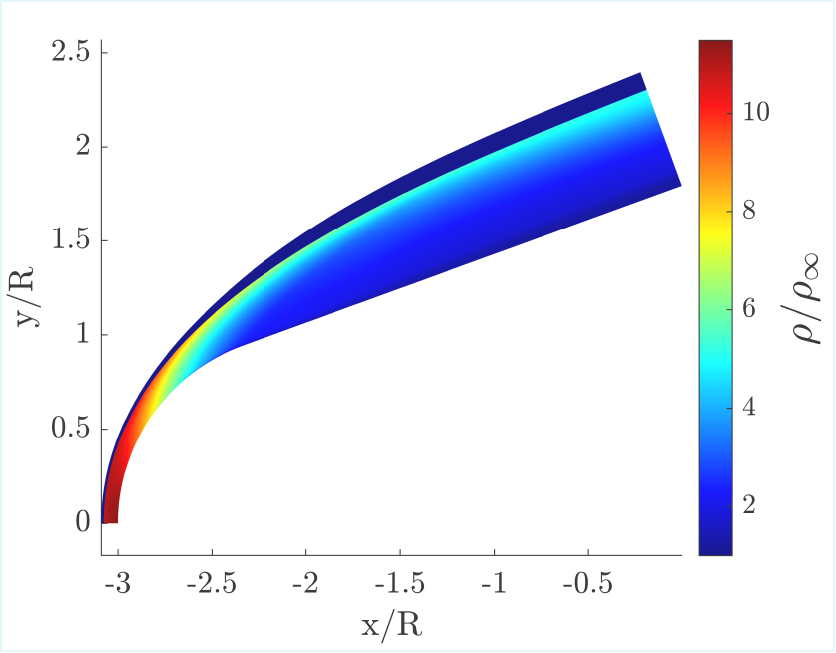
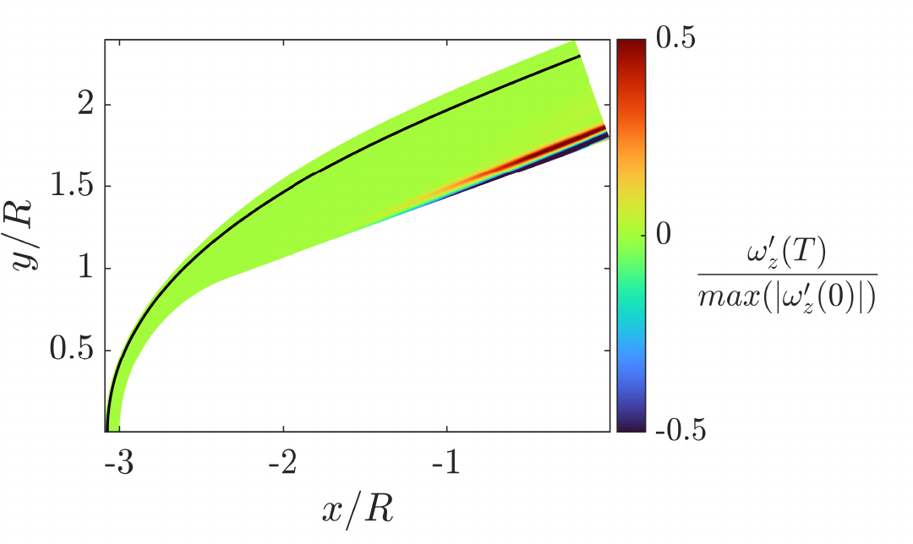
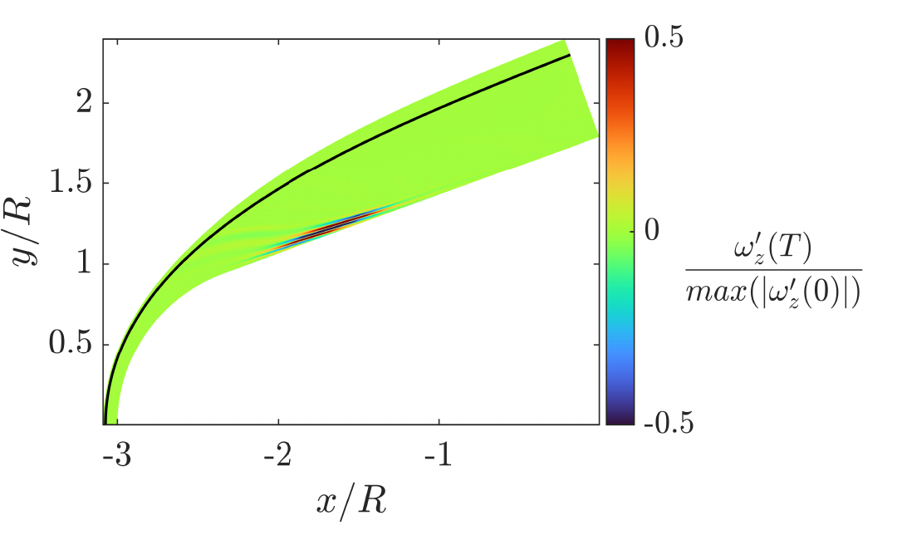
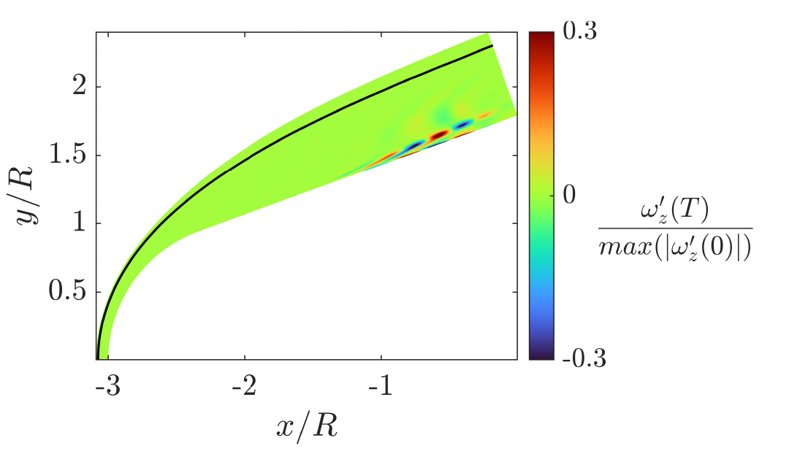
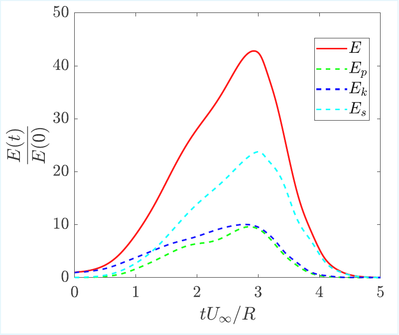
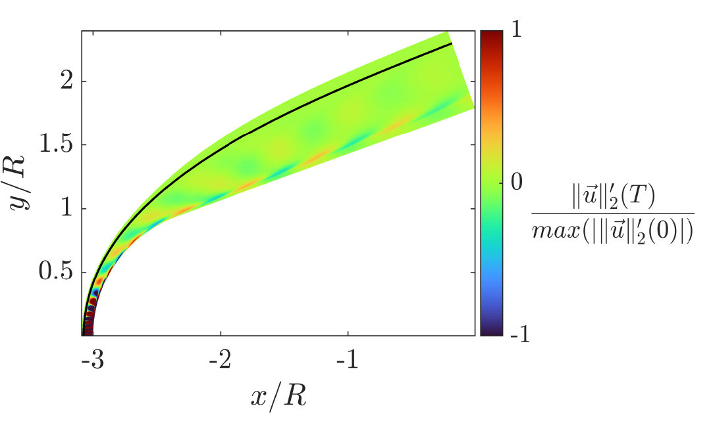
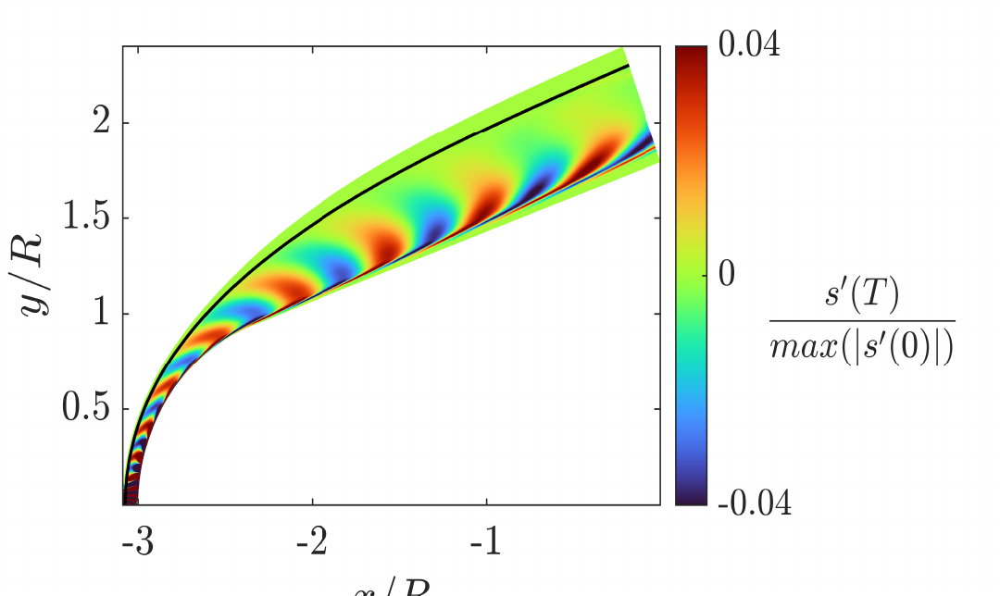
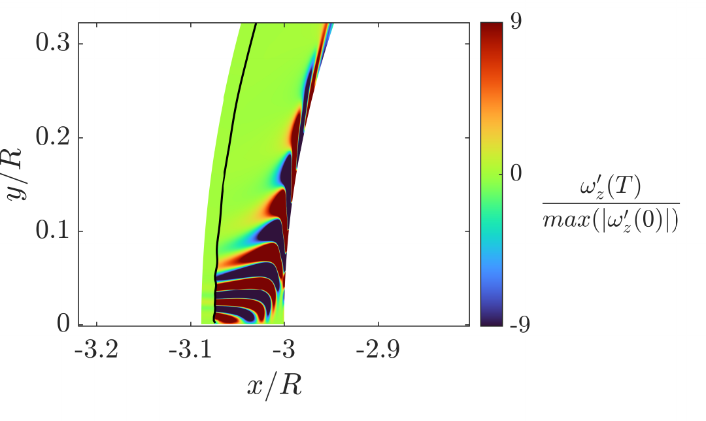
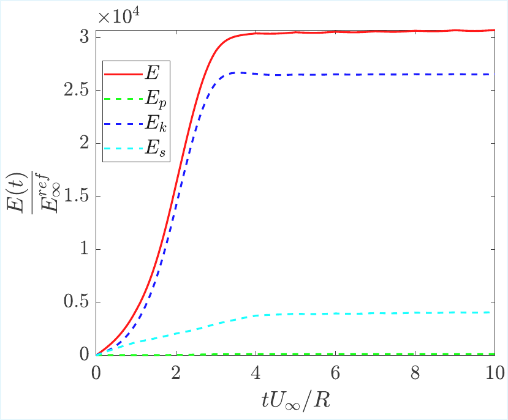

# Tutorial: Hypersonic Vehicle (Blunted Cone)

Runtime: ≈ 2 - 3 hours (with GPU 4090 mobile as accelerator)

## Goal

This tutorial demonstrates the most complete workflow of the solver: simulating **3D-axisymmetric hypersonic flow over a blunted cone** (hypersonic vehicle geometry) in an **Earth atmosphere** with equilibrium thermochemistry, and performing the full suite of **global stability analyses**:

1. **Modal analysis** -- Eigenvalues and eigenmodes of the linearized shock-layer operator.
2. **Non-modal transient growth** -- Optimal initial perturbations that maximize energy amplification over finite time horizons, with decomposition into acoustic, entropic, and kinetic energy components.
3. **Freestream receptivity** -- Optimal upstream disturbances that produce the largest shock-layer response.

The base flow is built through a multi-stage strategy: a coarse-grid run establishes the shock structure, followed by a fine-grid simulation at higher Reynolds number to resolve the boundary layer.

---

## Step-by-Step Walkthrough

To avoid redundancy, the MATLAB code is going to be used to illustrate the example. An analogous version in Julia of the tutorial with identical variable naming is also available.

### Step 1 -- Environment Setup (`main.m`)

```matlab
clear all
clc
solver_dir = '../../';
solution = struct();
solution.solver_dir = solver_dir;

addpath(solver_dir + "utils/Initialization/")
addpath(solver_dir + "utils/Mesh/")
addpath(solver_dir + "utils/Operators/")
addpath(solver_dir + "utils/Energy_budgets/")
addpath(solver_dir + "utils/Postprocessing/")
addpath(solver_dir + "utils/Shock_fitting/")
addpath(solver_dir + "utils/Time_marching/")
addpath(solver_dir + "chemistry/")
addpath(solver_dir + "utils/Stability_analysis/")
addpath(solver_dir + "utils/Stability_analysis/Eigenvalues/")
addpath(solver_dir + "utils/Stability_analysis/Modal_stability_analysis/")
addpath(solver_dir + "utils/Stability_analysis/Transient_growth_downstream/")
addpath(solver_dir + "utils/Stability_analysis/Freestream_receptivity/")
```

Clears the workspace and adds all solver utility paths. This tutorial uses every module available, including energy budgets, shock fitting, and all three stability-analysis submodules.

---

### Step 2 -- Load Input Parameters and Chemistry (`main.m`)

```matlab
filename = './input_file.m';
LOAD_INPUT_VARIABLES(filename);

if ~solution.restart
    chemistry = SET_CHEMISTRY(solution);
end
```

Loads the configuration from `input_file.m` and initializes the Earth atmosphere equilibrium chemistry model (`Chemical-RTVE`). This model accounts for rotational, translational, vibrational, and electronic energy modes with chemical equilibrium.

---

### Step 3 -- Initialize and Visualize the Domain (`main.m`)

```matlab
solution = INITIALIZATION(solution, solution_save, chemistry);
PLOT_INITIAL_SET_UP(solution);
```

Generates the body-fitted curvilinear mesh around the blunted cone and initializes the flow field using the Rankine-Hugoniot relations across the shock. The geometry is defined by the cone half-angle `theta`, the nose radius `R`, and the body length `L`.

---

### Step 4 -- Base Flow: Coarse Grid Computation (`main.m`)

```matlab
solution.restart                    = false;
solution.time_integration.N_iter    = 2000;
solution.freestream.Re              = 10000;
solution.shock.spline_param         = 1 - 1e-6 * 100^3 / solution.mesh.Nchi^3;
solution.mesh.Nchi = 200;
solution.mesh.Neta = 40;
solution = INITIALIZATION(solution, solution_save, chemistry);

solution_base = solution;
tic
solution = RUN_SIMULATION(solution, solution_base, chemistry);
toc
solution_save = solution;
```

The first simulation stage uses a **coarse grid** (200 x 40) at a moderate Reynolds number (10,000). A coarser spline smoothing parameter (`1e-6`) is used for the shock surface to ensure stability on the coarse mesh. This allows the shock and flow field to establish their main features without excessive computational cost.

**Key tuning parameters:**
| Parameter | Value | Guidance |
|-----------|-------|----------|
| `N_iter` | 2000 | Number of time steps. Increase if the residual has not converged. |
| `Re` | 10000 | Starting Reynolds number. Lower values produce thicker boundary layers that are easier to resolve on coarse grids. |
| `Nchi` | 200 | Streamwise resolution along the body surface. |
| `Neta` | 40 | Wall-normal resolution. Must capture the shock layer thickness. |

---

### Step 5 -- Base Flow: Fine Grid at High Reynolds (`main.m`)

```matlab
solution.restart                    = true;
solution.time_integration.N_iter    = 1000;
solution.freestream.Re              = 100000;
solution.shock.spline_param         = 1 - 1e-8 * 100^3 / solution.mesh.Nchi^3;
solution.mesh.Nchi = 800;
solution.mesh.Neta = 100;
solution = INITIALIZATION(solution, solution_save, chemistry);

solution_base = solution;
tic
solution = RUN_SIMULATION(solution, solution_base, chemistry);
toc
solution_save = solution;
```

The grid is refined to 800 x 100 and the Reynolds number is increased to 100,000. The spline smoothing parameter is tightened (`1e-8`) for the finer grid. The coarse-grid solution is interpolated onto the fine grid as the initial condition, greatly accelerating convergence.

**Key tuning parameters:**
| Parameter | Value | Guidance |
|-----------|-------|----------|
| `Nchi` | 800 | High streamwise resolution to capture instability wavelengths. |
| `Neta` | 100 | Fine wall-normal resolution needed at Re = 100,000 where the boundary and entropy layers are very thin. |
| `Re` | 100000 | Target Reynolds number. Higher Re produces thinner shear layers and shorter instability wavelengths, requiring more grid points. |

---

### Step 6 -- Visualize the Converged Base Flow (`main.m`)

```matlab
% Figure 1: Normalized density
pcolor(plot_x_coords, plot_y_coords, solution.var.rho(2:end-1,2:end-1) ./ solution.freestream.rho_0)

% Figure 2: Non-dimensional vorticity
[~, d_u_dy] = DERIVATIVE(u_vel_int, solution);
[d_v_dx, ~] = DERIVATIVE(v_vel_int, solution);
plot_c_data = (d_v_dx - d_u_dy) / solution.freestream.U * solution.curvilinear_mapping.R;
pcolor(plot_x_coords, plot_y_coords, plot_c_data)
```

Two diagnostic figures are produced. Below the density ratio of the steady state solution is shown.

<table>
<tr>
<td align="center"><br><b>Figure 1</b> Non-dimensional density ratio over the blunted cone.</td>
</tr>
</table>

---

### Step 7 -- Linearize the Governing Equations (`main.m`)

```matlab
[solution, L] = LINEARIZE_L(solution, chemistry);
```

Constructs the linearized Jacobian **L** by numerically perturbing the discretized governing equations (including 3D-axisymmetric source terms and chemistry) around the converged base flow.

---

### Step 8 -- Modal Stability Analysis (`main.m`)

```matlab
n_modes = 10;
[V, D] = EIGENVALUES(L, solution, n_modes);
```

Computes the n_modes most relevant eigenvalues of L and their associated eigenvectors (modes). The EIGENVALUES function internally selects the eigensolver based on solution.stability_analysis.eigenvalue_solver (CPU LU decomposition or GPU-accelerated Arnoldi iteration). You will see that some eigenvalues return identically 0.0 + 0.0i. The reason for this is that the disturbances upstream from the shock are set to zero in this analysis, only downstream disturbances are allowed. Therefore, because of this eigenmodes related to pure freestream disturbances have identically 0 eigenvalues, they belong to the kernel of the linear operator.

Each eigenvalue `sigma = sigma_r + i*sigma_i`:
- **sigma_r > 0**: unstable mode.
- **sigma_r < 0**: stable mode.
- **sigma_i**: oscillation frequency.

**Key tuning parameters:**
| Parameter | Value | Guidance |
|-----------|-------|----------|
| `n_modes` | 10 | Number of eigenvalues to compute. Increase for a fuller picture of the spectrum. Computation cost scales roughly linearly with `n_modes`. |
| `eigenvalue_solver` | `"GPU_TIMESTEPPER_ARNOLDI"` | The Arnoldi method with time-stepper avoids forming the full matrix. Use `"CPU_LU"` for small problems. |
| `perturbation_magnitude` | `1e-8` | Finite-difference step. Values between `1e-7` and `1e-9` are typical. |

---

### Step 9 -- Visualize Eigenmodes (`main.m`)

```matlab
mode = 3;
T_plot = 0;
freestream_disturbances = false;
solution.running_plot.scaling_range = 1/2;
PLOT_MODES(freestream_disturbances, L, solution, chemistry, V(:,mode), T_plot);
```

| Parameter | Description |
|-----------|-------------|
| `mode` | Which eigenmode to plot (column index of `V`). |
| `T_plot` | Time at which to evaluate the perturbation. `0` = initial mode shape. |
| `scaling_range` | Saturates the color range to a fraction of the maximum value. `1/2` shows the field at half the peak amplitude for better visibility. |

Below the most unstable eigenmode (closest eigenvalue to the imaginary axis) is shown.

<table>
<tr>
<td align="center"><br><b>Figure 2</b> Vorticity of the most unstable eigenmode at <code>T_plot = 0</code>.</td>
</tr>
</table>

---

### Step 10 -- Non-Modal Transient Growth (`main.m`)

```matlab
T_TGD = [3];
n_modes = 5;
V_TGD = zeros(4 * solution.mesh.Nchi * solution.mesh.Neta, n_modes, size(T_TGD,1));
D_TGD = zeros(n_modes, n_modes, length(T_TGD));

for i = 1:length(T_TGD)
    [V_TGD(:,:,i), D_TGD(:,:,i), T_opt_TGD(i,1)] = ...
        TRANSIENT_GROWTH_DOWNSTREAM(L, solution, n_modes, T_TGD(i,1));
end
```

Finds optimal initial perturbations that maximize energy gain `G(T) = ||q'(T)||^2 / ||q'(0)||^2` at each time horizon in `T_TGD`. Non-normal amplification can produce large transient growth even when all eigenvalues are stable.

**Key tuning parameters:**
| Parameter | Value | Guidance |
|-----------|-------|----------|
| `T_TGD` | `[3]` | Time horizons for the optimization. Try several values to trace out the growth envelope `G(T_TGD)`. |
| `n_modes` | 5 | Number of optimal modes per time horizon. Mode 1 gives the maximum gain. |

---

### Step 11 -- Visualize Transient Growth Modes (`main.m`)

```matlab
time_optimization_index = 1;
mode = 2;
T_plot = 0.0;
freestream_disturbances = false;
solution.running_plot.scaling_range = 1/2;
PLOT_MODES(freestream_disturbances, L, solution, chemistry, V_TGD(:,mode,time_optimization_index), T_plot);
```

| Parameter | Description |
|-----------|-------------|
| `time_optimization_index` | Selects which `T_TGD` entry to visualize (1 = first time horizon). |
| `mode` | Optimal mode index (1 = largest gain, 2 = second-largest, etc.). |
| `T_plot` | Time at which to show the perturbation. `0` = initial (optimal) perturbation shape. |

We select `mode = 2`, because the other first mode is spurious (caused by grid level frequency numerical reflection at the outflow). The figures below show the optimal non-modal perturbation for the blunted cone. The initial optimal disturbance (left) is concentrated at the boundary layer. After evolving to `T_plot = 2.5` (right), the perturbation has amplified and spread through the boundary layer.

<table>
<tr>
<td align="center"><br><b>Figure 3.a)</b> Vorticity of optimal non-modal disturbance at <code>T_plot = 0.0</code>.</td>
<td align="center"><br><b>Figure 3.b)</b> Vorticity of optimal non-modal disturbance at <code>T_plot = 2.5</code>.</td>
</tr>
</table>

---

### Step 12 -- Energy Decomposition of Transient Growth (`main.m`)

```matlab
T_f = 5;
mode = 2;
freestream_disturbances = false;
get_amplification_only = true;
max_gain = LINEAR_INTEGRATION_AND_GAINS(...
    freestream_disturbances, V_TGD(:,mode,time_optimization_index), ...
    D_TGD(mode,mode,time_optimization_index), T_opt_TGD(time_optimization_index,1), ...
    L, solution, chemistry, T_f, get_amplification_only);

disp("max_ref(E) = "   + max_gain.non_temporal.all)
disp("max_ref(E_p) = " + max_gain.non_temporal.acoustic)
disp("max_ref(E_S) = " + max_gain.non_temporal.entropic)
disp("max_ref(E_k) = " + max_gain.non_temporal.kinetic)
```

`LINEAR_INTEGRATION_AND_GAINS` evolves the optimal perturbation forward in time and decomposes the total energy amplification into its **Chu-norm** components:
- **E**: Total perturbation energy gain.
- **E_p**: Acoustic (pressure) energy component.
- **E_S**: Entropic energy component.
- **E_k**: Kinetic energy component.

| Parameter | Description |
|-----------|-------------|
| `T_f` | Final time of the integration (time over which energy growth is tracked). |
| `mode` | Which optimal mode to evolve. |
| `get_amplification_only` | When `true`, returns only the gain values without storing the full time history. |

Below you can see the transient energy growth in time of the optimal disturbance:

<table>
<tr>
<td align="center"><br><b>Figure 4</b> Transient energy growth of the optimal non-modal perturbation, decomposed into total, acoustic, entropic, and kinetic energy components.</td>
</tr>
</table>

---

### Step 13 -- Freestream Receptivity: Build Extended Operator (`main.m`)

```matlab
N_l = 40;
w_infty = 2*pi*linspace(0, N_l, N_l+1)';
[solution, L_] = LINEARIZE_L_(L, solution, chemistry, w_infty);
```

Constructs the extended operator **L_** that couples freestream perturbation dynamics with the shock-layer linear operator. The frequency vector `w_infty` defines the discrete streamwise wavenumbers for the incoming disturbances.

**Key tuning parameters:**
| Parameter | Value | Guidance |
|-----------|-------|----------|
| `N_l` | 40 | Number of freestream frequency modes. Determines the spectral resolution of upstream disturbances. Increase for finer frequency resolution at higher computational cost. |

---

### Step 14 -- Compute Freestream Receptivity Modes (`main.m`)

```matlab
T_TGF = [5];
n_modes = 5;
V_TGF = zeros(4 * solution.mesh.Nchi * solution.mesh.Neta + 4 * solution.mesh.Nchi * (N_l + 1), n_modes, length(T_TGF));
D_TGF = zeros(n_modes, n_modes, length(T_TGF));

for i = 1:length(T_TGF)
    [V_TGF(:,:,i), D_TGF(:,:,i), T_opt_TGF(i,1)] = ...
        FREESTREAM_RECEPTIVITY(L_, solution, n_modes, T_TGF(i,1), w_infty);
end
```

Finds the optimal freestream disturbance pattern that produces the maximum energy amplification inside the shock layer at time `T_TGF`. The arrays `V_TGF` and `D_TGF` are pre-allocated to store the resulting modes and eigenvalues.

**Key tuning parameters:**
| Parameter | Value | Guidance |
|-----------|-------|----------|
| `T_TGF` | `[5]` | Time horizon for the receptivity optimization. Should be long enough for upstream waves to interact with the shock and amplify. |
| `n_modes` | 5 | Number of optimal receptivity modes. |

---

### Step 15 -- Visualize Freestream Receptivity Modes (`main.m`)

```matlab
time_optimization_index = 1;
mode = 3;
T_plot = 10;
freestream_disturbances = true;
solution.running_plot.scaling_range = 1/10;
PLOT_MODES(freestream_disturbances, L_, solution, chemistry, ...
    V_TGF(:,mode,time_optimization_index), T_plot, w_infty);
```

Plots both the freestream disturbance and the resulting shock-layer perturbation. We select `mode = 3`, because the other first two modes are spurious (they are caused by numerical discretization error, and do not converge with mesh refinement).

| Parameter | Description |
|-----------|-------------|
| `scaling_range` | Saturates the color range to the given fraction of the maximum value. Useful when the freestream perturbation is much smaller than the shock-layer response. A value of `1/10` shows the field at 1/10 of the peak amplitude, revealing finer details. |

Setting freestream_disturbances = true activates the freestream component of the visualization. The figures below show the optimal freestream receptivity mode at `T_plot = 10`. The freestream disturbance excites the stagnation region. Later on the disturbance enters the boundary layer, which gives additional energy growth due to the mean shear.

<table>
<tr>
<td align="center"><br><b>Figure 5.a)</b> Velocity magnitude of optimal freestream receptivity mode at <code>T_plot = 10</code>.</td>
<td align="center"><br><b>Figure 5.b)</b> Entropy of optimal freestream receptivity mode at <code>T_plot = 10</code>.</td>
</tr>
<tr>
<td align="center"><br><b>Figure 5.c)</b> Vorticity (zoomed) of optimal freestream receptivity mode at <code>T_plot = 10</code>.</td>
<td></td>
</tr>
</table>

---

### Step 16 -- Freestream Receptivity Energy Decomposition (`main.m`)

```matlab
T_f = 10;
mode = 3;
freestream_disturbances = true;
get_amplification_only = true;
max_gain = LINEAR_INTEGRATION_AND_GAINS(...
    freestream_disturbances, V_TGF(:,mode,time_optimization_index), ...
    D_TGF(mode,mode,time_optimization_index), T_opt_TGF(time_optimization_index,1), ...
    L_, solution, chemistry, T_f, get_amplification_only, w_infty);

disp("max_ref(E) = "   + max_gain.non_temporal.all)
disp("max_ref(E_p) = " + max_gain.non_temporal.acoustic)
disp("max_ref(E_S) = " + max_gain.non_temporal.entropic)
disp("max_ref(E_k) = " + max_gain.non_temporal.kinetic)
```

Computes and prints the Chu-norm energy decomposition for the freestream receptivity mode, showing how upstream disturbances partition their energy into acoustic, entropic, and kinetic components inside the shock layer. It can be seen that the most amplified mode has gains around 20000 relative to freestream disturbance energy. This significant gain is caused mainly by the Mach squared scaling of disturbance energy when they cross a strong shock (McKenzie & Westphal 1968). In this case due to the high Mach number, this gives rise to large energy growths.

<table>
<tr>
<td align="center"><br><b>Figure 6</b> Freestream receptivity energy growth, decomposed into total, acoustic, entropic, and kinetic energy components.</td>
</tr>
</table>

### References

- McKenzie, J.F. and Westphal, K.O., 1968. Interaction of linear waves with oblique shock waves. *Physics of Fluids*, 11, 2350–2362.
- 
---

## Key Input File Parameters (`input_file.m`)

### PDE Dimension

```matlab
solution.PDE_dimension = "3D-axisymmetric";
```

| Parameter | Effect | Guidance |
|-----------|--------|----------|
| `PDE_dimension` | `"2D"` for planar flows, `"3D-axisymmetric"` for bodies of revolution. | The 3D-axisymmetric formulation adds geometric source terms for the azimuthal curvature. Use for entry capsules, cones, and spheres. |

### Chemistry

```matlab
solution.chemistry.is_chemistry_enabled       = true;
solution.chemistry.chemistry_type        = "Chemical-RTVE";
solution.chemistry.chemical_equilibrium  = true;
solution.chemistry.non_equilibrium_model = "linear";
solution.chemistry.chemistry_composition      = "Earth";
```

| Parameter | Options | Guidance |
|-----------|---------|----------|
| `is_chemistry_enabled` | `true` / `false` | Set `true` for realistic high-enthalpy flows. When `false`, the solver uses a calorically perfect gas with constant `gamma`. |
| `chemistry_type` | `"Frozen-RTV"`, `"Frozen-RTVE"`, `"Chemical-RTV"`, `"Chemical-RTVE"` | Controls the level of thermochemical fidelity. `RTVE` includes electronic excitation in addition to rotational-translational-vibrational modes. `Chemical` allows dissociation/recombination. |
| `chemical_equilibrium` | `true` / `false` | When `true`, chemical composition is in local thermodynamic equilibrium. When `false`, finite-rate kinetics are used with the non-equilibrium model. |
| `non_equilibrium_model` | `"linear"`, `"quadratic"` | Interpolation model for non-equilibrium source terms. Only relevant when `chemical_equilibrium = false`. |
| `chemistry_composition` | `"Earth"`, `"Mars"`, `"CO2"` | Selects the atmospheric gas mixture and its thermodynamic/kinetic data. |

### Geometry (Blunted Cone)

```matlab
solution.curvilinear_mapping.boundary_type = "blunt_cone";
solution.curvilinear_mapping.theta         = 70 * pi / 180;  % Half-angle [rad]
solution.curvilinear_mapping.R             = 1;               % Nose radius
solution.curvilinear_mapping.L             = 3;               % Body length
solution.curvilinear_mapping.dRe           = 0.6;             % Outer boundary at outflow
solution.curvilinear_mapping.dRs           = 0.4;             % Outer boundary at stagnation
```

| Parameter | Effect | Guidance |
|-----------|--------|----------|
| `theta` | Half-angle of the cone body (in radians). | Typical entry capsules: 60-70 degrees. Sharper cones (e.g., 10-20 degrees) produce weaker shocks. |
| `R` | Nose sphere radius (reference length). | Reynolds number and all geometric dimensions are normalized by `R`. |
| `L` | Streamwise distance from the cone tip to the outflow boundary. | Must be long enough to capture the flow features of interest. |
| `dRe` | Wall-normal distance of the outer domain boundary at the outflow edge. | Must exceed the local shock standoff distance. |
| `dRs` | Wall-normal distance of the outer domain boundary at the stagnation point. | Must exceed the stagnation-point shock standoff. |

### Mesh Refinement

```matlab
solution.curvilinear_mapping.refinement_stagnation.state        = true;
solution.curvilinear_mapping.refinement_stagnation.BL_thickness = 0.2;
solution.curvilinear_mapping.refinement_stagnation.intensity    = 0.99;
solution.curvilinear_mapping.refinement_wall.state              = false;
solution.curvilinear_mapping.smooth_mesh = true;
```

| Parameter | Effect | Guidance |
|-----------|--------|----------|
| `refinement_stagnation.state` | Activates grid clustering near the stagnation point. | Enable for blunt bodies where the stagnation entropy layer requires fine resolution. |
| `refinement_stagnation.BL_thickness` | Fraction of the wall-normal domain over which stagnation clustering is applied. | `0.2` = inner 20% of the domain. Decrease for thinner layers. |
| `refinement_stagnation.intensity` | Clustering strength (`0` = none, approaching `1` = extreme). | `0.99` provides very aggressive clustering. Reduce if mesh quality degrades. |
| `smooth_mesh` | Applies smoothing at curvature discontinuities (sphere-cone junction). | Set `true` to avoid mesh singularities at the tangent point. |

### Freestream Conditions (Chemistry Mode)

```matlab
solution.freestream.u   = 4000;    % [m/s]
solution.freestream.v   = 0;       % [m/s]
solution.freestream.rho = 0.001;   % [kg/m^3]
solution.freestream.T   = 270;     % [K]
solution.freestream.Re  = 100000;
```

| Parameter | Effect | Guidance |
|-----------|--------|----------|
| `u` | Freestream velocity. At 4000 m/s and 270 K in Earth's atmosphere, this corresponds to approximately Mach 12. | Adjust for different entry trajectories. |
| `rho` | Freestream density. `0.001 kg/m^3` is representative of ~50 km altitude on Earth. | Use `ATMOSPHERE_PROPERTIES` for different altitudes. |
| `T` | Freestream temperature. | Sets thermodynamic state and speed of sound. |
| `Re` | Reynolds number based on nose radius `R`. | `100,000` produces thin boundary layers requiring fine meshes. Start with lower values on coarse grids. |

### Shock Fitting

```matlab
solution.shock.enabled              = true;
solution.shock.feedback             = true;
solution.shock.interpolate          = "2nd";
solution.shock.initial_shock_dist   = 0.3;
solution.shock.remesh_shock_distance = 1.2;
solution.shock.relaxation           = 1.0;
solution.shock.formulation          = "Lagrangian";
solution.shock.fitting              = "csaps";
solution.shock.spline_param         = 1 - 1e-8 * 100^3 / solution.mesh.Nchi^3;
solution.shock.initial_beta         = 55 * pi / 180;
```

| Parameter | Effect | Guidance |
|-----------|--------|----------|
| `initial_shock_dist` | Initial guess for the shock standoff distance from the wall. | Should be close to the expected physical value. |
| `initial_beta` | Initial shock angle guess (radians) used by the Rankine-Hugoniot solver to initialize post-shock conditions. | Should approximate the oblique shock angle for the cone. For blunt cones, values around 50-60 degrees are typical. |
| `interpolate` | `"1st"` = first-order (robust), `"2nd"` = second-order (accurate), `"3rd"` = third-order. | Use `"1st"` during startup transients, switch to `"2nd"` or higher once the flow is established. The default in the input file is `"2nd"`. |
| `spline_param` | Controls shock-surface smoothness. The default formula `1 - 1e-8 * 100^3 / Nchi^3` automatically adjusts with grid resolution. The coarse-grid stage in `main.m` overrides this with `1e-6` for stability. | Decrease (move away from 1) for smoother shock surfaces if point-to-point oscillations appear. |

### Time Integration

```matlab
solution.time_integration.N_iter          = 1000;
solution.time_integration.time_integrator = "Explicit_RK4";
solution.time_integration.CFL            = 2;
solution.time_integration.dt             = 0.000001;
solution.time_integration.max_dt         = 0.3;
```

| Parameter | Effect | Guidance |
|-----------|--------|----------|
| `N_iter` | Time steps per simulation stage. | Increase until residuals plateau. |
| `CFL` | CFL number for adaptive time stepping. | `2` is a good default for explicit RK4. Reduce if the simulation becomes unstable. |
| `dt` | Initial time step. | Start small; the CFL controller will ramp it up automatically. |
| `max_dt` | Maximum allowable time step. | Prevents overshooting transient phenomena. |

### Live Plotting

```matlab
solution.running_plot.enabled   = true;
solution.running_plot.variable  = {'div_U', 'rho', 'vort'};
solution.running_plot.timesteps = 100;
```

| Parameter | Effect | Guidance |
|-----------|--------|----------|
| `variable` | Fields to display during time marching. Options include: `'rho'`, `'u'`, `'v'`, `'p'`, `'T'`, `'div_U'`, `'vort'`, and chemistry species (e.g., `'CO2'`). | `'div_U'` (velocity divergence) is useful for spotting acoustic waves and shock-related features. |
| `timesteps` | Update interval (in time steps) for the live plots. | Lower values give more frequent updates but slow the simulation. `100` is a reasonable balance. |
