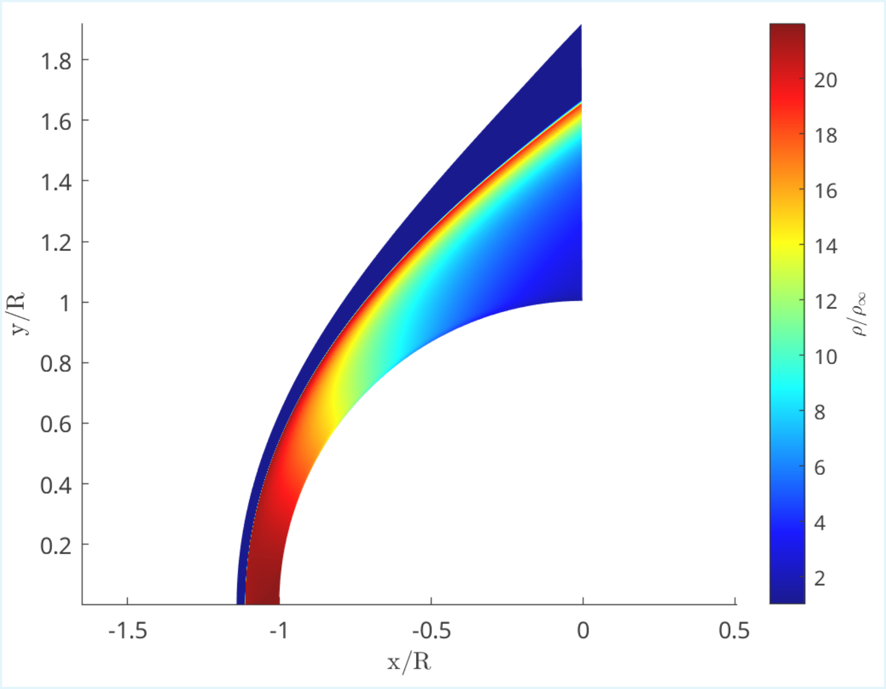
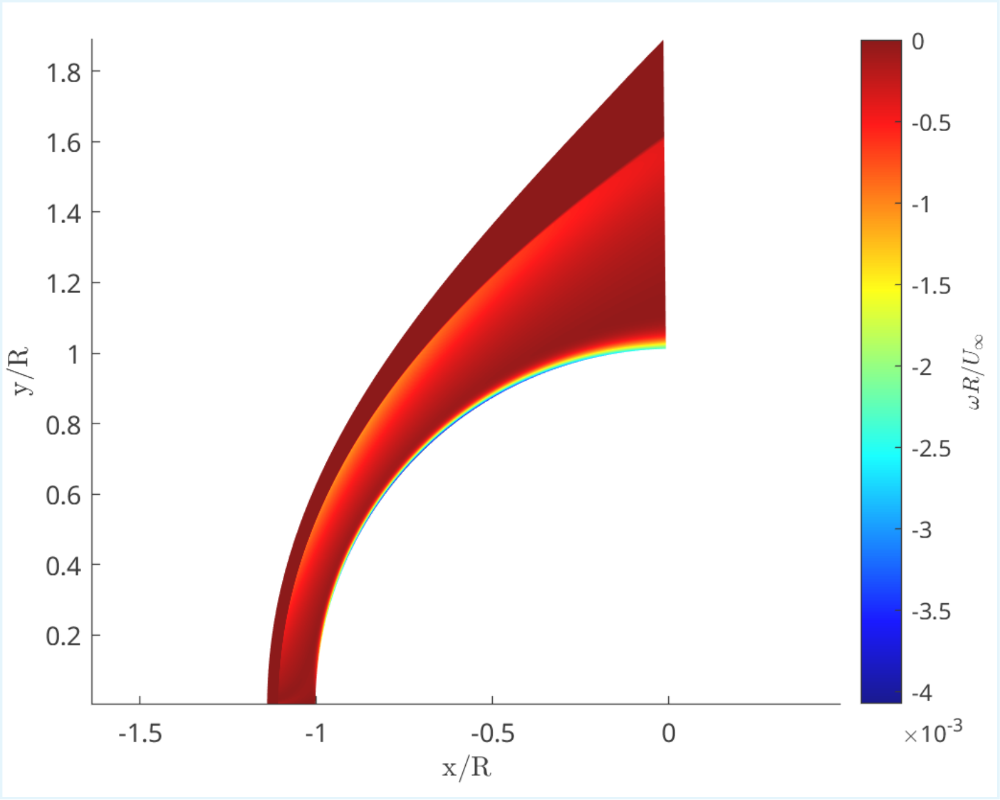
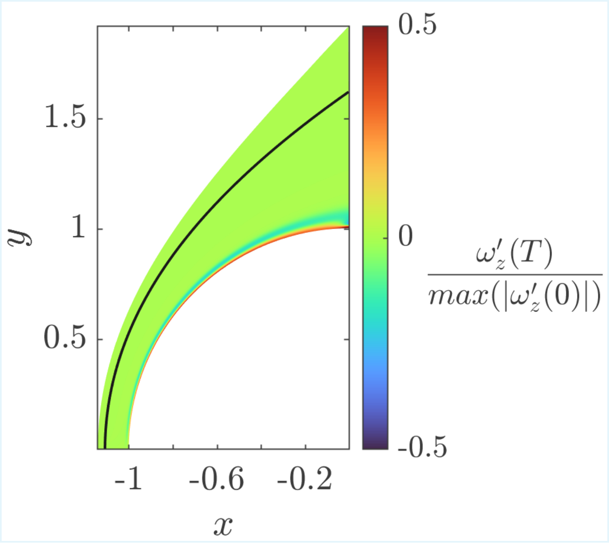
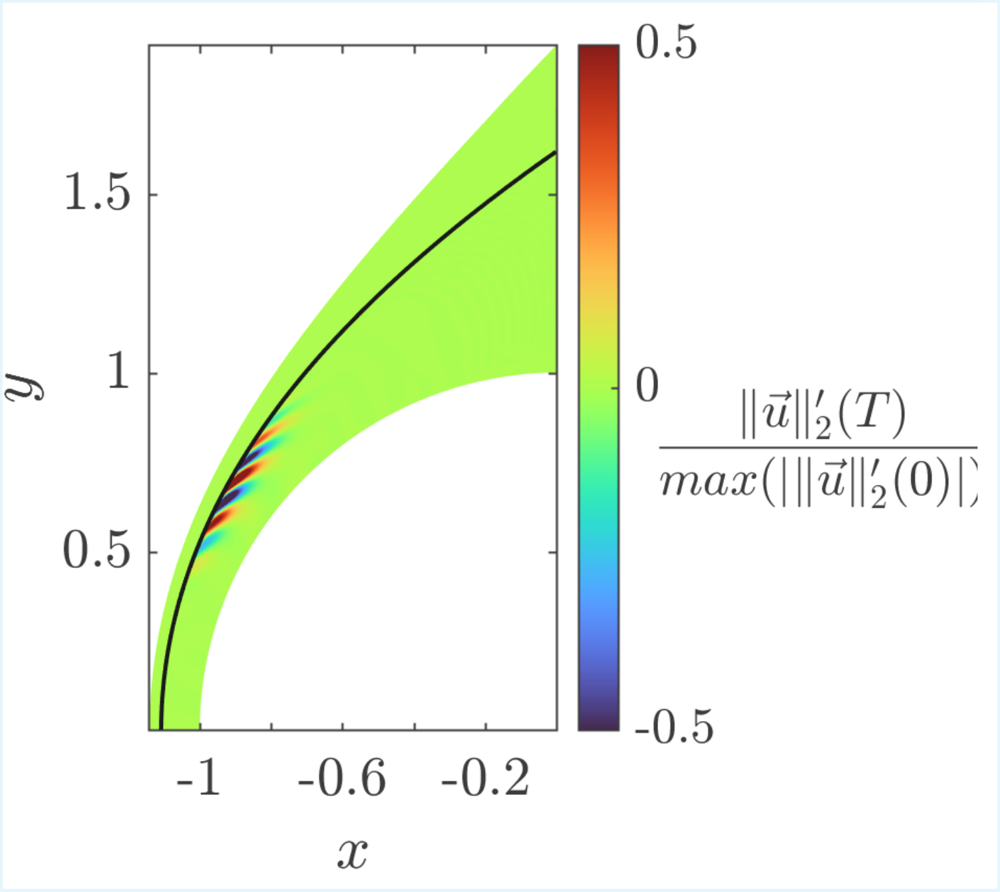
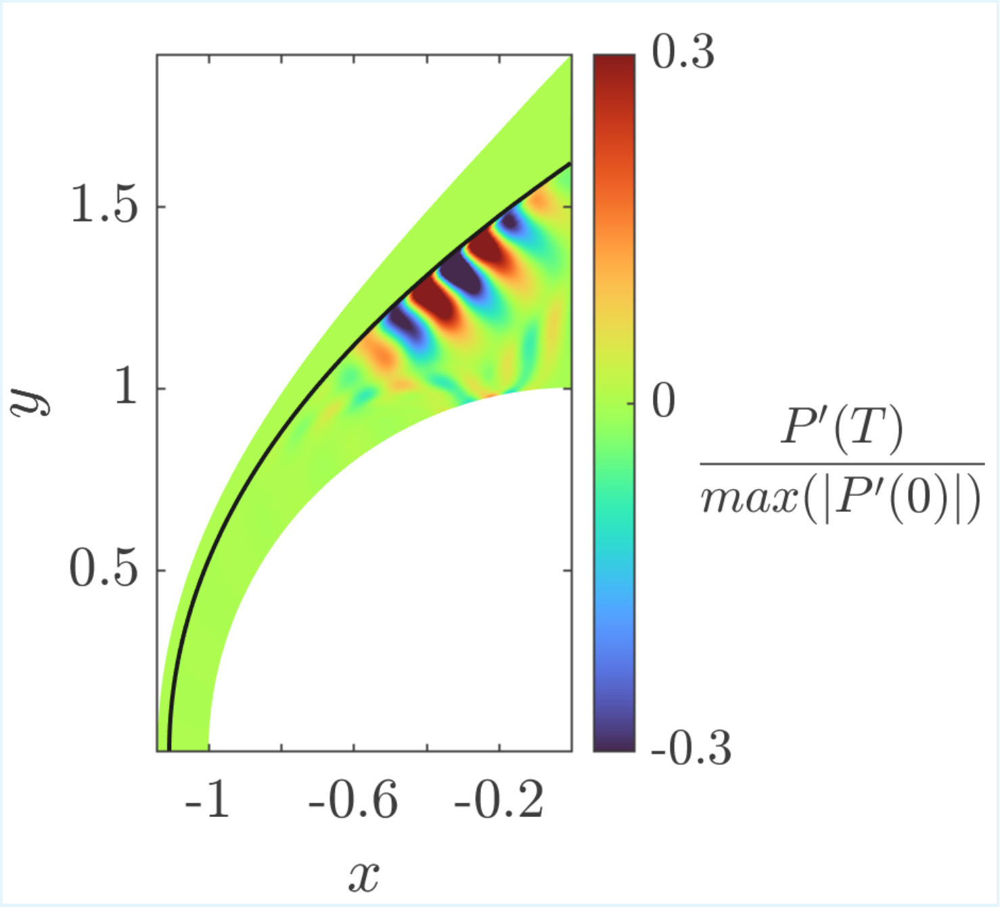
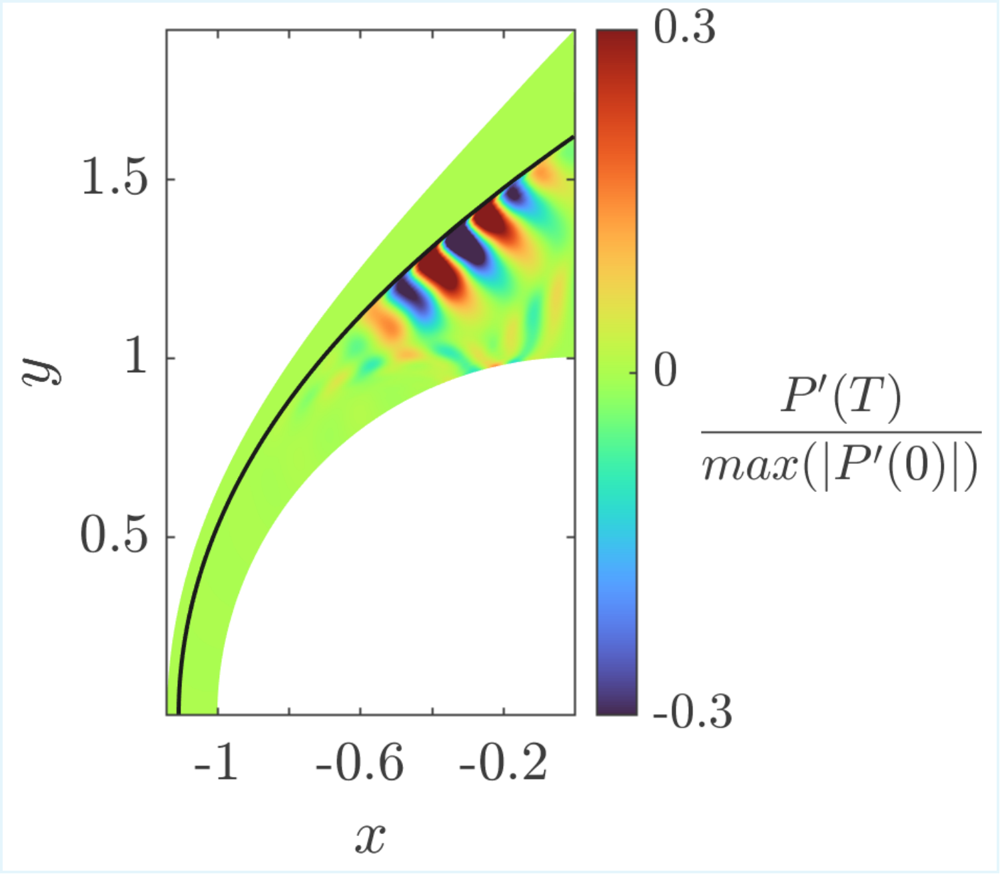
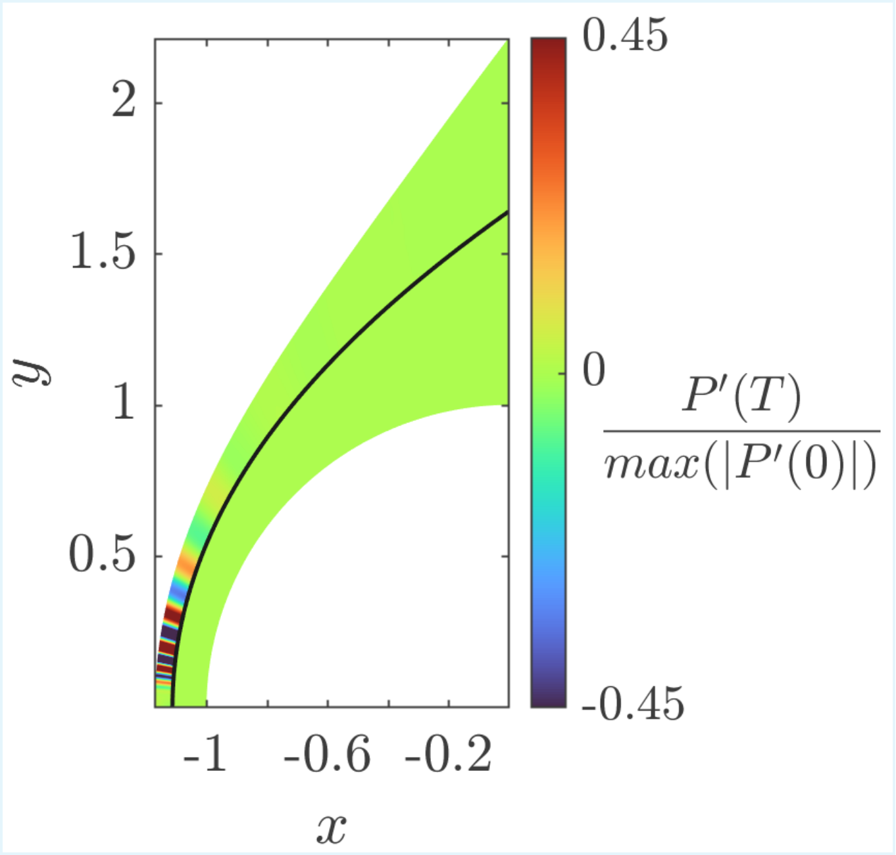
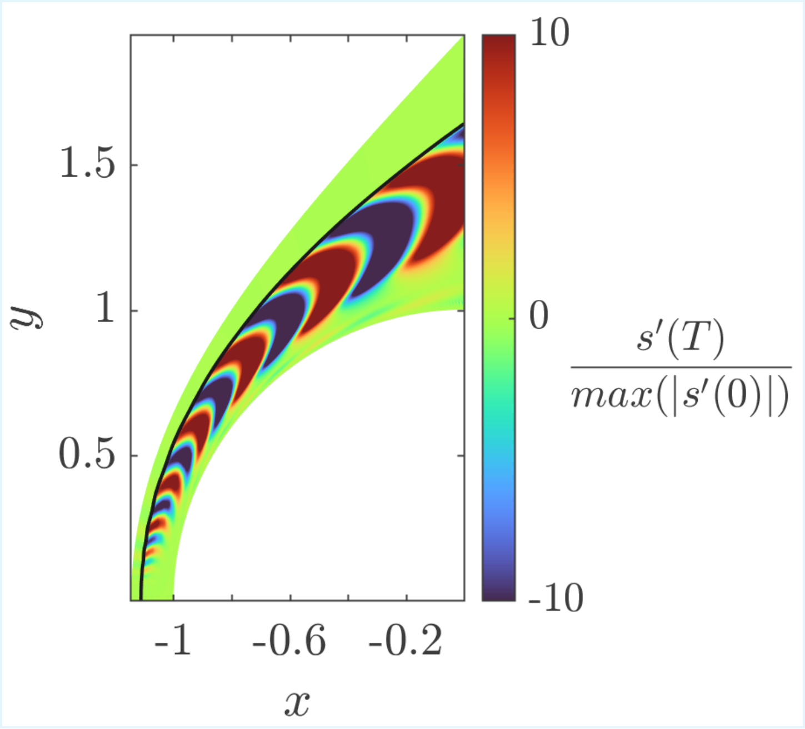
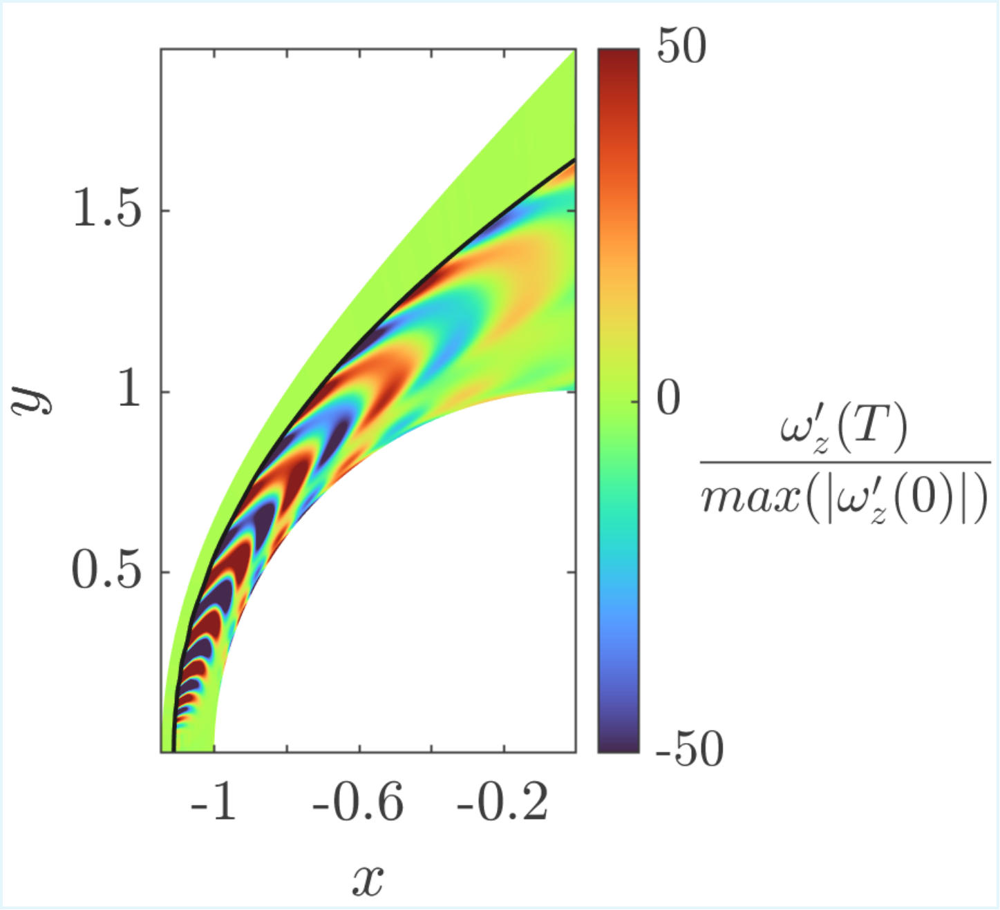

# Tutorial: Hypersonic Flow over a Cylinder

Runtime: ≈ 10 - 20 min

## Goal

This tutorial demonstrates how to simulate **hypersonic flow over a circular cylinder** in a **Mars atmosphere** with equilibrium thermochemistry, and perform a comprehensive **linear stability analysis** of the resulting high-enthalpy flow. It showcases the solver's shock-fitting capability and walks through three levels of stability analysis:

1. **Non-linear solver + shock-fitting + chemistry** -- Compute the base flow of high-enthalpy cylinder.
2. **Modal analysis** -- Compute eigenvalues/eigenmodes to identify the most unstable modes.
3. **Non-modal transient growth** -- Find optimal initial perturbations that maximize energy amplification over a finite time horizon.
4. **Freestream receptivity** -- Determine which freestream disturbances are most efficiently amplified by the shock layer.

The base flow is computed through a multi-stage strategy that progressively increases the freestream velocity and refines the grid to reach a well-converged steady state.

---

## Step-by-Step Walkthrough

To avoid redundancy, the MATLAB code is going to be used to illustrate the example. An analogous version in Julia of the tutorial with identical variable naming is also available.

### Step 1 -- Environment Setup (`main.m`, lines 46--65)

```matlab
clear all
clc
solver_dir = '../../';
solution = struct();
solution.solver_dir = solver_dir;

addpath(solver_dir + "utils/Initialization/")
addpath(solver_dir + "utils/Mesh/")
addpath(solver_dir + "utils/Operators/")
addpath(solver_dir + "utils/Energy_budgets/")
addpath(solver_dir + "utils/Postprocessing/")
addpath(solver_dir + "utils/Shock_fitting/")
addpath(solver_dir + "utils/Time_marching/")
addpath(solver_dir + "chemistry/")
addpath(solver_dir + "utils/Stability_analysis/")
addpath(solver_dir + "utils/Stability_analysis/Eigenvalues/")
addpath(solver_dir + "utils/Stability_analysis/Modal_stability_analysis/")
addpath(solver_dir + "utils/Stability_analysis/Transient_growth_downstream/")
addpath(solver_dir + "utils/Stability_analysis/Freestream_receptivity/")
```

All utility directories are added to the MATLAB path, including shock-fitting, energy-budget, transient-growth, and freestream-receptivity modules. Update `solver_dir` if you run from a different location.

---

### Step 2 -- Load Input Parameters and Chemistry (`main.m`)

```matlab
filename = './input_file.m';
LOAD_INPUT_VARIABLES(filename);

if ~solution.restart
    chemistry = SET_CHEMISTRY(solution);
end
```

Loads all parameters from `input_file.m` and initializes the Mars equilibrium chemistry model (`Chemical-RTVE`). The chemistry model provides thermodynamic properties (specific heats, enthalpy, speed of sound) that vary with temperature and composition behind the shock.

---

### Step 3 -- Initialize and Visualize the Domain (`main.m`)

```matlab
solution = INITIALIZATION(solution, solution_save, chemistry);
PLOT_INITIAL_SET_UP(solution);
```

Generates the curvilinear mesh around the cylinder and initializes the flow field using the Rankine-Hugoniot jump conditions across the shock. `PLOT_INITIAL_SET_UP` displays the mesh and initial condition for inspection.

---

### Step 4 -- Base Flow Computation: Coarse Grid at Low Speed (`main.m`)

```matlab
solution.restart                      = false;
solution.time_integration.N_iter      = 1500;
solution.freestream.u                 = 2000;    % [m/s]
solution.freestream.Re                = 2000;
solution = INITIALIZATION(solution, solution_save, chemistry);

solution_base = solution;
tic
solution = RUN_SIMULATION(solution, solution_base, chemistry);
toc
solution_save = solution;
```

The first simulation stage runs on a **coarse grid** (200 x 40) at a **reduced freestream velocity** (2000 m/s). Starting at a lower speed avoids numerical difficulties from an excessively strong initial shock transient. The solution is saved in `solution_save` for the next restart.

**Key tuning parameters:**
| Parameter | Value | Guidance |
|-----------|-------|----------|
| `N_iter` | 1500 | Enough iterations for the shock to settle. Increase if residuals have not plateaued. |
| `freestream.u` | 2000 m/s | A moderate starting velocity. Start lower if the solver diverges. |
| `freestream.Re` | 2000 | Low Reynolds to add viscous damping during the transient. |

---

### Step 5 -- Base Flow Computation: Coarse Grid at Target Speed (`main.m`)

```matlab
solution.restart                      = true;
solution.shock.interpolate            = "1st";
solution.time_integration.N_iter      = 3500;
solution.freestream.u                 = 5000;    % [m/s]
solution.freestream.Re                = 2000;
solution = INITIALIZATION(solution, solution_save, chemistry);

solution_base = solution;
tic
solution = RUN_SIMULATION(solution, solution_base, chemistry);
toc
solution_save = solution;
```

The velocity is increased to the target 5000 m/s. First-order shock interpolation (`"1st"`) is used here for **robustness** -- a strong secondary shock can momentarily form behind the main shock during the speed ramp-up, and first-order interpolation handles this more stably.

**Key tuning parameters:**
| Parameter | Value | Guidance |
|-----------|-------|----------|
| `shock.interpolate` | `"1st"` | Use `"1st"` during strong transients for robustness. Switch to `"2nd"` or `"3rd"` once the flow is settled for better accuracy. |
| `N_iter` | 3500 | Must be large enough for the shock to fully adjust to the new speed. |

---

### Step 6 -- Base Flow Computation: Fine Grid at High Reynolds (`main.m`)

```matlab
solution.restart                      = true;
solution.shock.interpolate            = "2nd";
solution.time_integration.N_iter      = 1000;
solution.freestream.u                 = 5000;    % [m/s]
solution.freestream.Re                = 20000;
solution.mesh.Nchi = 400;
solution.mesh.Neta = 80;
solution.curvilinear_mapping.refinement_stagnation.state        = true;
solution.curvilinear_mapping.refinement_stagnation.BL_thickness = 0.2;
solution.curvilinear_mapping.refinement_stagnation.intensity    = 0.95;
solution.curvilinear_mapping.refinement_wall.state              = true;
solution.curvilinear_mapping.refinement_wall.BL_thickness       = 0.1;
solution.curvilinear_mapping.refinement_wall.intensity          = 0.995;
solution = INITIALIZATION(solution, solution_save, chemistry);
```

The grid is refined to 400 x 80 and the Reynolds number is raised to 20,000. Mesh refinement is activated near the **stagnation point** and the **wall** to resolve thin boundary/entropy layers.

**Key tuning parameters:**
| Parameter | Value | Guidance |
|-----------|-------|----------|
| `Nchi` | 400 | Streamwise (along-wall) resolution. Increase for high-frequency instabilities. |
| `Neta` | 80 | Wall-normal resolution. Must resolve the shock-layer and boundary-layer profiles. |
| `refinement_stagnation.BL_thickness` | 0.2 | Fraction of the wall-normal domain over which clustering is applied near the stagnation region. |
| `refinement_stagnation.intensity` | 0.95 | Clustering strength. `0` = no refinement, close to `1` = extreme refinement. |
| `refinement_wall.BL_thickness` | 0.1 | Thickness of the wall-clustered region. |
| `refinement_wall.intensity` | 0.995 | High intensity to resolve the thin viscous boundary layer. |

---

### Step 7 -- Visualize the Converged Base Flow (`main.m`)

```matlab
% Density field
pcolor(plot_x_coords, plot_y_coords, solution.var.rho(2:end-1,2:end-1) ./ solution.freestream.rho_0)

% Vorticity field
[~, d_u_dy] = DERIVATIVE(u_vel_int, solution);
[d_v_dx, ~] = DERIVATIVE(v_vel_int, solution);
plot_c_data = (d_v_dx - d_u_dy) / solution.freestream.U * solution.curvilinear_mapping.R;
pcolor(plot_x_coords, plot_y_coords, plot_c_data)
```

Two figures are produced:
- **Figure 1**: Normalized density field. Verifies the shock standoff distance and post-shock compression.
- **Figure 2**: Non-dimensional vorticity field. Shows vorticity generated at the curved shock (baroclinic mechanism) and the wall boundary layer.

<table>
<tr>
<td align="center"><br><b>Figure 1.a)</b> Non-dimensional density ratio.</td>
<td align="center"><br><b>Figure 1.b)</b> Non-dimensional vorticity.</td>
</tr>
</table>

---

### Step 8 -- Linearize the Governing Equations (`main.m`)

```matlab
[solution, L] = LINEARIZE_L(solution, chemistry);
```

Constructs the linearized Jacobian matrix **L** by numerical differentiation of the discretized Navier-Stokes equations around the converged base flow. The perturbation evolution is governed by dq'/dt = L * q'.

---

### Step 9 -- Modal Stability Analysis (`main.m`)

```matlab
n_modes = 10;
[V, D] = EIGENVALUES(L, solution, n_modes);
```

Computes the `n_modes` most relevant eigenvalues of **L** and their associated eigenvectors (modes). The `EIGENVALUES` function internally selects the eigensolver based on `solution.stability_analysis.eigenvalue_solver` (CPU LU decomposition or GPU-accelerated Arnoldi iteration). You will see that some eigenvalues return identically 0.0 + 0.0i. The reason for this is that the disturbances upstream from the shock are set to zero in this analysis, only downstream disturbances are allowed. Therefore, because of this eigenmodes related to pure freestream disturbances have identically 0 eigenvalues, they belong to the kernel of the linear operator.

Each eigenvalue `sigma = sigma_r + i*sigma_i`:
- **sigma_r > 0**: unstable (growing) mode.
- **sigma_r < 0**: stable (decaying) mode.
- **sigma_i**: oscillation frequency.

**Key tuning parameters:**
| Parameter | Value | Guidance |
|-----------|-------|----------|
| `n_modes` | 10 | Number of eigenvalues to compute. Increase to capture a broader spectrum. |
| `eigenvalue_solver` | `"GPU_TIMESTEPPER_ARNOLDI"` | Use `"CPU_LU"` for small problems or `"GPU_TIMESTEPPER_ARNOLDI"` for large matrices. |
| `perturbation_magnitude` | `1e-8` | Finite-difference step for linearization. Values between `1e-7` and `1e-9` are typical. |

---

### Step 10 -- Visualize Eigenmodes (`main.m`)

```matlab
mode = 3;
T_plot = 0;
freestream_disturbances = false;
PLOT_MODES(freestream_disturbances, L, solution, chemistry, V(:,mode), T_plot);
```

Plots the spatial structure of eigenmode number `mode`. The perturbation fields (density, velocity, vorticity ...) are shown. For example, the most unstable eigenvalue (closest to the imaginary axis) is shown below. This mode is modally stable (Re = 20000), and it consists of a shear vortical mode in the boundary layer.

<table>
<tr>
<td align="center"><br><b>Figure 2.a)</b> Vorticity of the most unstable eigenmode.</td>
</tr>
</table>

| Parameter | Description |
|-----------|-------------|
| `mode` | Index of the eigenmode to plot (column of `V`). |
| `T_plot` | Time at which to evaluate. At `T_plot = 0`, the initial mode shape is shown. Non-zero values show the mode evolved by `exp(sigma * T_plot)`. |

---

### Step 11 -- Non-Modal Transient Growth Analysis (`main.m`)

```matlab
T_TGD = [0.5; 1.0; 1.5]; 
n_modes = 5;
V_TGD = zeros(4 * solution.mesh.Nchi * solution.mesh.Neta, n_modes, size(T_TGD,1));
D_TGD = zeros(n_modes, n_modes, length(T_TGD));

for i = 1:length(T_TGD)
    [V_TGD(:,:,i), D_TGD(:,:,i), T_opt_TGD(i,1)] = ...
        TRANSIENT_GROWTH_DOWNSTREAM(L, solution, n_modes, T_TGD(i,1));
end
```

`TRANSIENT_GROWTH_DOWNSTREAM` finds the **optimal initial perturbation** that maximizes the energy gain `G(T) = ||q'(T)||^2 / ||q'(0)||^2` over a time horizon `T`. Even when all eigenvalues are stable, non-normal operators can produce significant transient energy amplification. 

**Key tuning parameters:**
| Parameter | Value | Guidance |
|-----------|-------|----------|
| `T_TGD` | `[0.5; 1.0; 1.5]` | Time horizons for optimization. Short times capture faster mechanisms; longer times capture slower-growing phenomena. Try a range of values to map the growth envelope. |
| `n_modes` | 5 | Number of optimal modes per time horizon. The first mode gives the maximum gain; subsequent modes are sub-optimal. |

---

### Step 12 -- Visualize Transient Growth Modes (`main.m`)

```matlab
time_optimization_index = 2;
mode = 1;
T_plot = 1.5;
freestream_disturbances = false;
PLOT_MODES(freestream_disturbances, L, solution, chemistry, V_TGD(:,mode,time_optimization_index), T_plot);
```

Displays the optimal initial perturbation that produces the largest transient energy growth at the selected time horizon.

| Parameter | Description |
|-----------|-------------|
| `time_optimization_index` | Selects which entry in `T_TGD` to visualize (1 = first time horizon, 2 = second, etc.). |
| `mode` | Optimal mode index (1 = maximum gain, 2 = second-largest, etc.). |

Below some optimal transient growth are shown. For example it can be seen that for `T_TGD = 1.0` the initial disturbance is placed close to the shock wave. The disturbance later interacts with the shock wave, and emits acoustic modes that bounce on the cylinder wall. These acoustic disturbances also induce vortical disturbances close to the wall as can be seen. The growth of this mechanisms in terms of the Chu energy norm is small, around 10, because the Reynolds is still not very high, Re = 20000, and dissipation mechanisms kill the disturbances. Another reason why disturbances do not grow a lot in this scenario is that they are advected outside of the computational domain quite fast, and do not have time to grow.

<table>
<tr>
<td align="center"><br><b>Figure 3.a)</b> Initial velocity magnitude of optimal disturbance, at <code>T_plot = 0.0</code>, <code>mode = 1</code>, <code>time_optimization_index = 2</code>.</td>
<td align="center"><br><b>Figure 3.b)</b> Pressure of optimal disturbance, at <code>T_plot = 1.5</code>, <code>mode = 1</code>, <code>time_optimization_index = 2</code>.</td>
</tr>
<tr>
<td align="center"><br><b>Figure 3.c)</b> Vorticity of optimal disturbance, at <code>T_plot = 1.5</code>, <code>mode = 1</code>, <code>time_optimization_index = 2</code>.</td>
<td></td>
</tr>
</table>

---

### Step 13 -- Freestream Receptivity: Build Extended Operator (`main.m`)

```matlab
N_l = 40;
w_infty = 2*pi*linspace(0, N_l, N_l+1)';
[solution, L_] = LINEARIZE_L_(L, solution, chemistry, w_infty);
```

`LINEARIZE_L_` constructs an **extended linear operator** that couples the shock-layer dynamics with incoming freestream perturbations. The vector `w_infty` contains the discrete streamwise frequencies allowed for the upstream disturbances. Note that w_infty is non-dimensionalized by the freestream velocity magnitude and characteristic length L.

**Key tuning parameters:**
| Parameter | Value | Guidance |
|-----------|-------|----------|
| `N_l` | 40 | Number of freestream frequency modes. Higher values resolve finer upstream spectral content at greater cost. |

---

### Step 14 -- Compute Freestream Receptivity Modes (`main.m`)

```matlab
T_TGF = [5];
n_modes = 5;

for i = 1:length(T_TGF)
    [V_TGF(:,:,i), D_TGF(:,:,i), T_opt_TGF(i,1)] = ...
        FREESTREAM_RECEPTIVITY(L_, solution, n_modes, T_TGF(i,1), w_infty);
end
```

`FREESTREAM_RECEPTIVITY` finds the **optimal freestream disturbance** that maximizes energy amplification inside the shock layer at time `T_TGF`. It can be seen that the most amplified mode has gains around 20000 relative to freestream disturbance energy. This significant gain is caused mainly by the Mach squared scaling of disturbance energy when they cross a strong shock (McKenzie & Westphal 1968). In this case due to the high Mach number, this gives rise to large energy growths.

**Key tuning parameters:**
| Parameter | Value | Guidance |
|-----------|-------|----------|
| `T_TGF` | `[5]` | Time horizon for freestream receptivity optimization. Should be long enough for freestream perturbations to interact with the shock and amplify in the shock layer. |
| `n_modes` | 5 | Number of optimal receptivity modes to compute. |

---

### Step 15 -- Visualize Freestream Receptivity Modes (`main.m`)

```matlab
time_optimization_index = 1;
mode = 2;
T_plot = 5;
freestream_disturbances = true;
PLOT_MODES(freestream_disturbances, L_, solution, chemistry, V_TGF(:,mode,time_optimization_index), T_plot, w_infty);
```

We select `mode = 2`, because the other first mode is spurious (does not converge with numerical refinement). Plots both the upstream freestream disturbance pattern and the resulting perturbation field inside the shock layer at time `T_plot`. Setting `freestream_disturbances = true` activates the freestream component of the visualization. It can be seen that the initial optimal disturbance is placed in the entropy-shear layer to exploit mechanisms of the entropy-shear layer generated by shock curvature. This disturbance excites a growth mechanism that propagates across the entropy layer, while it interacts with the shock-wave.

<table>
<tr>
<td align="center"><br><b>Figure 4.a)</b> Initial freestream pressure of second optimal disturbance, at <code>T_TGF = 5</code>, <code>T_plot = 0.0</code>, <code>mode = 2</code>, <code>time_optimization_index = 1</code>.</td>
<td align="center"><br><b>Figure 4.b)</b> Pressure of second optimal disturbance, at <code>T_TGF = 5</code>, <code>T_plot = 5</code>, <code>mode = 2</code>, <code>time_optimization_index = 1</code>.</td>
</tr>
<tr>
<td align="center"><br><b>Figure 4.c)</b> Vorticity of second optimal disturbance, at <code>T_TGF = 5</code>, <code>T_plot = 5</code>, <code>mode = 2</code>, <code>time_optimization_index = 1</code>.</td>
<td></td>
</tr>
</table>

### References

- McKenzie, J.F. and Westphal, K.O., 1968. Interaction of linear waves with oblique shock waves. *Physics of Fluids*, 11, 2350–2362.

---

## Key Input File Parameters (`input_file.m`)

### Chemistry

```matlab
solution.chemistry.is_chemistry_enabled       = true;
solution.chemistry.chemistry_type        = "Chemical-RTVE";
solution.chemistry.chemical_equilibrium  = true;
solution.chemistry.non_equilibrium_model = "linear";
solution.chemistry.chemistry_composition      = "Mars";
```

| Parameter | Effect | Guidance |
|-----------|--------|----------|
| `is_chemistry_enabled` | Enables high-temperature thermochemistry. When `false`, a calorically perfect gas with constant `gamma` is used. | Set `true` for realistic hypersonic flows where vibrational excitation, dissociation, or ionization matter. |
| `chemistry_type` | Chemistry model fidelity. `"Frozen-RTV"` = frozen rotational-translational-vibrational. `"Chemical-RTVE"` = chemical equilibrium with electronic excitation. | Use `"Frozen-RTV"` for faster runs and `"Chemical-RTVE"` for full fidelity. |
| `chemistry_composition` | Atmospheric gas mixture. Options: `"Earth"`, `"Mars"`, `"CO2"`. | Select based on the planetary scenario. |

### Geometry

```matlab
solution.curvilinear_mapping.boundary_type    = "circle";
solution.curvilinear_mapping.R                = 1;
solution.curvilinear_mapping.dRe              = 1.5;
solution.curvilinear_mapping.dRs              = 0.5;
```

| Parameter | Effect | Guidance |
|-----------|--------|----------|
| `R` | Cylinder radius (reference length). | All lengths and Reynolds number are normalized by `R`. |
| `dRe` | Domain outer boundary distance from the wall at the outflow edge. | Must be larger than the shock standoff distance at the edge. |
| `dRs` | Domain outer boundary distance from the wall at the stagnation point. | Must be larger than the shock standoff distance at stagnation. |

### Freestream Conditions (Chemistry Mode)

```matlab
solution.freestream.u   = 5000;    % [m/s]
solution.freestream.rho = 0.001;   % [kg/m^3]
solution.freestream.T   = 300;     % [K]
solution.freestream.Re  = 10000;
```

| Parameter | Effect | Guidance |
|-----------|--------|----------|
| `u` | Freestream velocity in m/s. | Determines the Mach number together with temperature. At 300 K in Mars CO2, this gives roughly Mach 20. |
| `rho` | Freestream density in kg/m^3. | Typical Mars atmospheric density at entry altitudes. |
| `T` | Freestream temperature in K. | Sets the speed of sound and thermodynamic state. |
| `Re` | Reynolds number (based on cylinder radius `R`). | Controls boundary-layer thickness and viscous effects. Higher Re gives thinner layers, sharper gradients, and requires finer meshes. |

### Shock Fitting

```matlab
solution.shock.enabled              = true;
solution.shock.feedback             = true;
solution.shock.interpolate          = "2nd";
solution.shock.initial_shock_dist   = 0.4;
solution.shock.remesh_shock_distance = 1.3;
solution.shock.relaxation           = 1.0;
solution.shock.formulation          = "Lagrangian";
solution.shock.fitting              = "csaps";
solution.shock.spline_param         = 1 - 1e-6 * 100^3 / solution.mesh.Nchi^3;
```

| Parameter | Effect | Guidance |
|-----------|--------|----------|
| `enabled` | Activates the shock-fitting algorithm. | Must be `true` for blunt-body hypersonic flows. |
| `feedback` | Allows the shock to respond dynamically to flow perturbations. | Set `true` for physical shock dynamics. Set `false` to freeze the shock position (useful for debugging). |
| `interpolate` | Order of data interpolation between shock and grid (`"1st"`, `"2nd"`, `"3rd"`). | Use `"1st"` during strong transients, `"2nd"` or `"3rd"` for the final converged solution. |
| `initial_shock_dist` | Initial guess for the shock standoff distance from the wall. | Should approximate the expected physical standoff. |
| `remesh_shock_distance` | Ratio controlling how far the outer mesh boundary extends beyond the shock. | Values > 1 ensure the domain outer boundary stays ahead of the shock. |
| `relaxation` | Under-relaxation for shock speed. `1.0` = full physical speed, `< 1` = damped. | Reduce below 1 if the shock oscillates or the solver diverges. |
| `formulation` | Shock reference frame. `"Lagrangian"` = mesh moves with the shock. `"Eulerian"` = fixed mesh. | `"Lagrangian"` is more robust for shock-fitted methods. |
| `fitting` | Spline method for the shock surface. `"csaps"` = cubic smoothing spline. | `"csaps"` gives a smooth result whose derivatives are analytically available. |
| `spline_param` | Smoothing parameter for `csaps` (between 0 and 1). Values close to 1 follow the data closely; lower values smooth more. | The default formula scales with `Nchi`. Decrease for smoother shock surfaces if oscillations appear. |

### Time Integration

```matlab
solution.time_integration.N_iter          = 1000;
solution.time_integration.time_integrator = "Explicit_RK4";
solution.time_integration.CFL            = 2;
solution.time_integration.dt             = 0.000001;
solution.time_integration.max_dt         = 0.3;
```

| Parameter | Effect | Guidance |
|-----------|--------|----------|
| `N_iter` | Number of time steps per simulation stage. | Increase if residuals have not converged. |
| `time_integrator` | Time scheme. `"Explicit_RK4"` is 4th-order Runge-Kutta. `"Implicit_Euler"` is available for stiff problems. | RK4 is the default. Use implicit if CFL restrictions are too severe. |
| `CFL` | CFL number for adaptive time stepping. | Higher = larger time steps but less stability margin. `2` is typical for RK4. |
| `dt` | Initial time step in seconds. | Start small; the adaptive CFL will ramp it up. |
| `max_dt` | Upper cap on the time step. | Prevents excessively large steps that might miss transient dynamics. |
